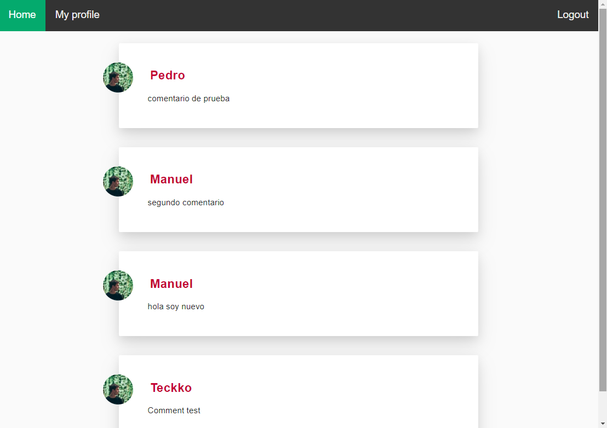
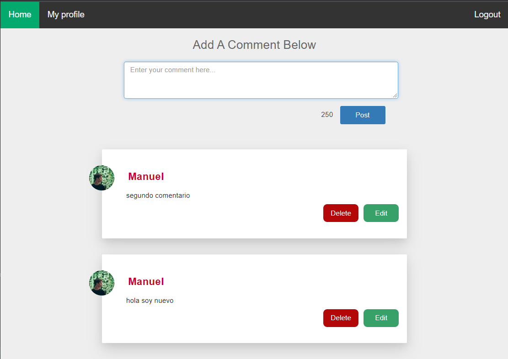
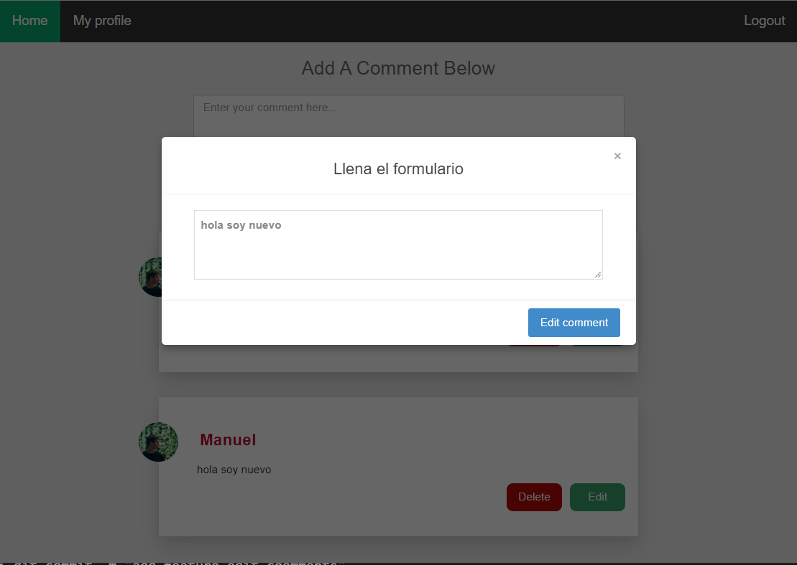
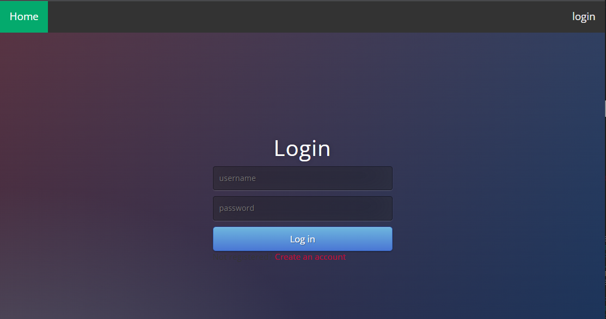
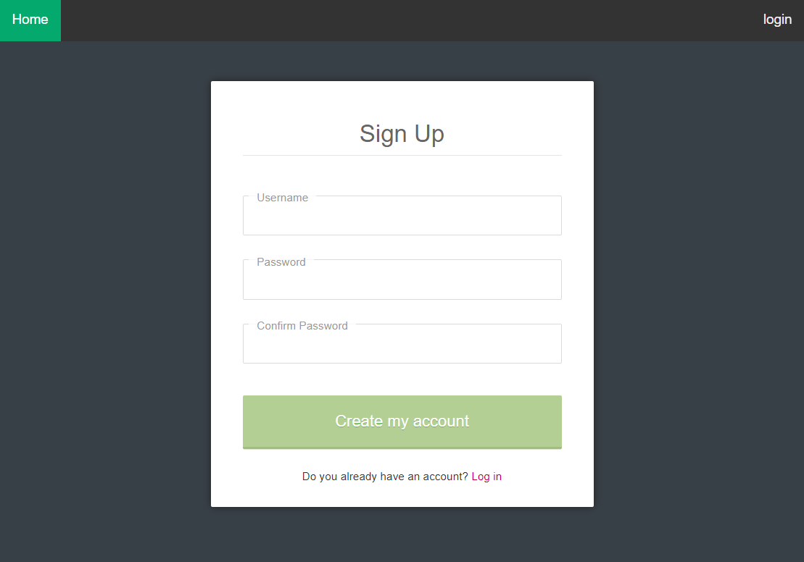

# APPCOMMENT

**Description**

> Simple page for manage todo tasks.

**Features**

> Loggin manager secure for users. Create users. Create comment, edit and delete comment.

**Technologies**

- Python
- Flask
- Firestore
- CSS
- HTML
- Bootstrap
- Javascripts

**VIEWS**

**INDEX**

**PROFILE**

**EDIT**

**LOGIN**

**SIGNUP**
